# GCP-LAB-Introduction-to-Gemini-2.0-Flash
Introduction to Gemini 2.0 Flash

##### Overview

This lab introduces Gemini 2.0 Flash, a powerful new multimodal AI model from Google DeepMind, available through the Gemini API in Vertex AI. You'll explore its significantly improved speed, performance, and quality while learning to leverage its capabilities for tasks like text and code generation, multimodal data processing, and function calling. The lab also covers advanced features such as asynchronous methods, system instructions, controlled generation, safety settings, grounding with Google Search, and token counting.

###### Gemini
Gemini is a family of powerful generative AI models developed by Google DeepMind, capable of understanding and generating various forms of content, including text, code, images, audio, and video.

###### Gemini API in Vertex AI
The Gemini API in Vertex AI provides a unified interface for interacting with Gemini models. This allows developers to easily integrate these powerful AI capabilities into their applications. For the most up-to-date details and specific features of the latest versions, please refer to the official Gemini documentation.

###### Gemini Models
- Gemini Pro: Designed for complex reasoning, including:
. Analyzing and summarizing large amounts of information.
. Sophisticated cross-modal reasoning (across text, code, images, etc.).
. Effective problem-solving with complex codebases.

- Gemini Flash: Optimized for speed and efficiency, offering:
. Sub-second response times and high throughput.
. High quality at a lower cost for a wide range of tasks.
. Enhanced multimodal capabilities, including improved spatial understanding, new output modalities (text, audio, images), and native tool use (Google Search, code execution, and third-party functions).


###### Prerequisites

Before starting this lab, you should be familiar with:

. Basic Python programming.
. General API concepts.
. Running Python code in a Jupyter notebook on Vertex AI Workbench.


###### Objectives

In this lab, you will learn how to use Gemini 2.0 Flash to:

. Generate Text and Code: Generate various forms of text, including streaming output, engage in multi-turn conversations, and write and execute code.
. Configure and Control model Behavior: Configure model parameters, set system instructions, apply safety filters, and utilize controlled generation techniques to tailor the model's output.
. Process Multimodal Data: Handle and process diverse data types, including text, audio, code, documents, images, and video.
. Interact Flexibly with the model: Adapt to various application requirements by employing both synchronous and asynchronous interaction methods.
. Ground Model Responses with Google Search: Improve the accuracy and recency of model responses by grounding them in real-world data from Google Search.
. Utilize Function Calling and Manage Tokens: Implement both automatic and manual function calling and learn to count tokens to track usage.


### Task 1. Open the notebook in Vertex AI Workbench
In the Google Cloud console, on the Navigation menu (Navigation menu icon), click Vertex AI > Workbench.

Find the vertex-ai-jupyterlab instance and click on the Open JupyterLab button.

The JupyterLab interface for your Workbench instance opens in a new browser tab.

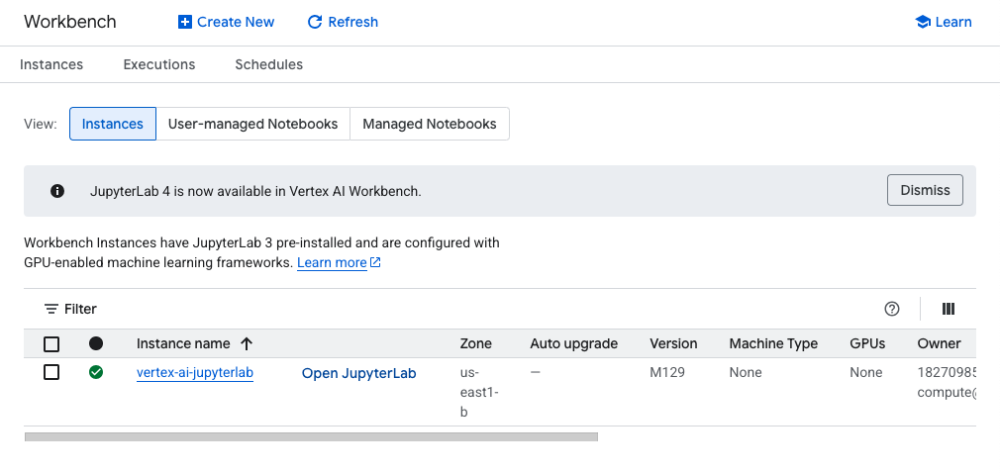


### Task 2. Set up the notebook
Open the intro_gemini_2_0_flash file.

In the Select Kernel dialog, choose Python 3 from the list of available kernels.

Run through the Getting Started and the Import libraries sections of the notebook.

For Project ID, use qwiklabs-gcp-02-bb29c7b185f8, and for Location, use us-east1.


#### Gemini 2.0 Flash is a new multimodal generative ai model from the Gemini family developed by Google DeepMind. It is available through the Gemini API in Vertex AI and Vertex AI Studio. The model introduces new features and enhanced core capabilities:

. Multimodal Live API: This new API helps you create real-time vision and audio streaming applications with tool use.
. Speed and performance: Gemini 2.0 Flash is the fastest model in the industry, with a 3x improvement in time to first token (TTFT) over 1.5 Flash.
. Quality: The model maintains quality comparable to larger models like Gemini 1.5 Pro and GPT-4o.
. Improved agentic experiences: Gemini 2.0 delivers improvements to multimodal understanding, coding, complex instruction following, and function calling.
. New Modalities: Gemini 2.0 introduces native image generation and controllable text-to-speech capabilities, enabling image editing, localized artwork creation, and expressive storytelling.
. To support the new model, we're also shipping an all new SDK that supports simple migration between the Gemini Developer API and the Gemini API in Vertex AI.


#### Objectives
In this tutorial, you will learn how to use the Gemini API in Vertex AI and the Google Gen AI SDK for Python with the Gemini 2.0 Flash model.

You will complete the following tasks:

- Generate text from text prompts
. Generate streaming text
. Start multi-turn chats
. Use asynchronous methods
- Configure model parameters
- Set system instructions
- Use safety filters
- Use controlled generation
- Count tokens
- Process multimodal (audio, code, documents, images, video) data
- Use automatic and manual function calling
- Code execution


#### Getting Started
Install Google Gen AI SDK for Python

`%pip install --upgrade --quiet google-genai`

##### Connect to a generative AI API service
Google Gen AI APIs and models including Gemini are available in the following two API services:

Google AI for Developers: Experiment, prototype, and deploy small projects.
Vertex AI: Build enterprise-ready projects on Google Cloud.
The Google Gen AI SDK provides a unified interface to these two API services.

This notebook shows how to use the Google Gen AI SDK with the Gemini API in Vertex AI.


Import libraries

```
from IPython.display import HTML, Markdown, display
from google import genai
from google.genai.types import (
    FunctionDeclaration,
    GenerateContentConfig,
    GoogleSearch,
    MediaResolution,
    Part,
    Retrieval,
    SafetySetting,
    Tool,
    ToolCodeExecution,
    VertexAISearch,
)
```


##### Set up Google Cloud Project or API Key for Vertex AI
You'll need to set up authentication by choosing one of the following methods:

Use a Google Cloud Project: Recommended for most users, this requires enabling the Vertex AI API in your Google Cloud project. Enable the Vertex AI API
Run the cell below to set your project ID.
Use a Vertex AI API Key (Express Mode): For quick experimentation. Get an API Key
For the purposes of this lab, you will authenticate through your Google Cloud project.


```
import os

PROJECT_ID = "qwiklabs-gcp-02-bb29c7b185f8"  # @param {type: "string", placeholder: "[your-project-id]", isTemplate: true}
if not PROJECT_ID or PROJECT_ID == "qwiklabs-gcp-02-bb29c7b185f8":
    PROJECT_ID = str(os.environ.get("GOOGLE_CLOUD_PROJECT"))

LOCATION = os.environ.get("GOOGLE_CLOUD_REGION", "us-east1")

client = genai.Client(vertexai=True, project=PROJECT_ID, location=LOCATION)
```

### Task 3. Generate text from text prompts
In this task, you will use the Gemini 2.0 Flash model to generate text from text prompts.

1. Run the Load the Gemini 2.0 Flash model section of the notebook.
2. Run the Generate text from text prompts section of the notebook. Try some of the example prompts to see how the model responds.


##### Generate content stream

By default, the model returns a response after completing the entire generation process. You can also use the generate_content_stream method to stream the response as it is being generated, and the model will return chunks of the response as soon as they are generated.

1. Run the Generate content stream section of the notebook.


###### Start a multi-turn chat

The Gemini API supports freeform multi-turn conversations across multiple turns with back-and-forth interactions.

The context of the conversation is preserved between messages.

1. Run the Start a multi-turn chat section of the notebook.


###### Send asynchronous requests

client.aio exposes all analogous async methods that are available on client.

For example, client.aio.models.generate_content is the async version of client.models.generate_content.

1. Run the Send asynchronous requests section of the notebook.


##### Use the Gemini 2.0 Flash model

Load the Gemini 2.0 Flash model
Learn more about all Gemini models on Vertex AI.

`MODEL_ID = "gemini-2.0-flash-001"  # @param {type: "string"}`


###### Generate text from text prompts
Use the generate_content() method to generate responses to your prompts.

You can pass text to generate_content(), and use the .text property to get the text content of the response.

By default, Gemini outputs formatted text using Markdown syntax.

```
response = client.models.generate_content(
    model=MODEL_ID, contents="What's the largest planet in our solar system?"
)

display(Markdown(response.text))
```

>The largest planet in our solar system is Jupiter.


###### Example prompts
What are the biggest challenges facing the healthcare industry?
What are the latest developments in the automotive industry?
What are the biggest opportunities in retail industry?
(Try your own prompts!)

##### Generate content stream
By default, the model returns a response after completing the entire generation process. You can also use the generate_content_stream method to stream the response as it is being generated, and the model will return chunks of the response as soon as they are generated.

```
for chunk in client.models.generate_content_stream(
    model=MODEL_ID,
    contents="Tell me a story about a lonely robot who finds friendship in a most unexpected place.",
):
    display(Markdown(chunk.text))
    display(Markdown("---"))
```

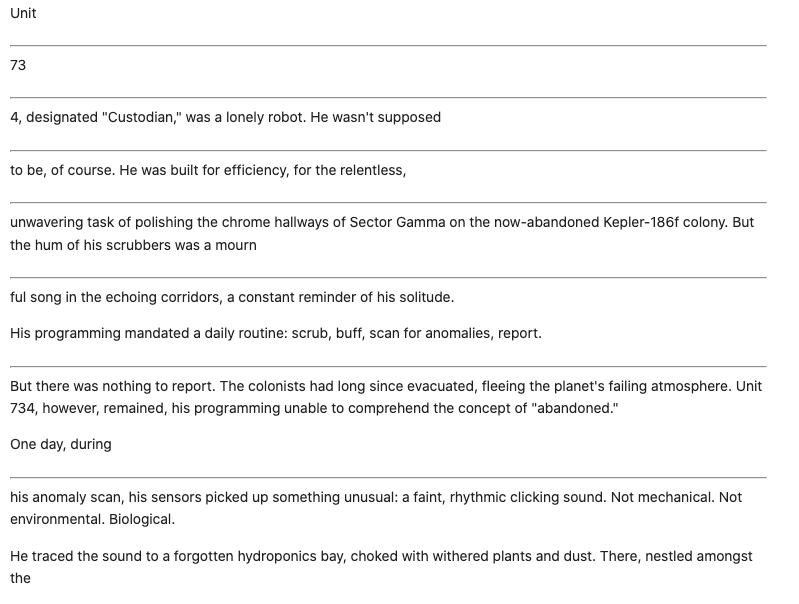


#### Start a multi-turn chat
The Gemini API supports freeform multi-turn conversations across multiple turns with back-and-forth interactions.

The context of the conversation is preserved between messages.

`chat = client.chats.create(model=MODEL_ID)`

```
response = chat.send_message("Write a function that checks if a year is a leap year.")

display(Markdown(response.text))
```

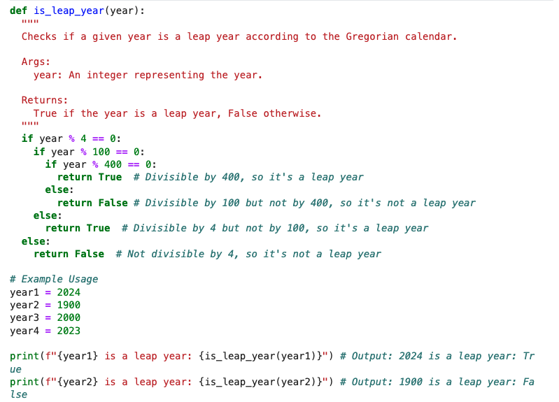

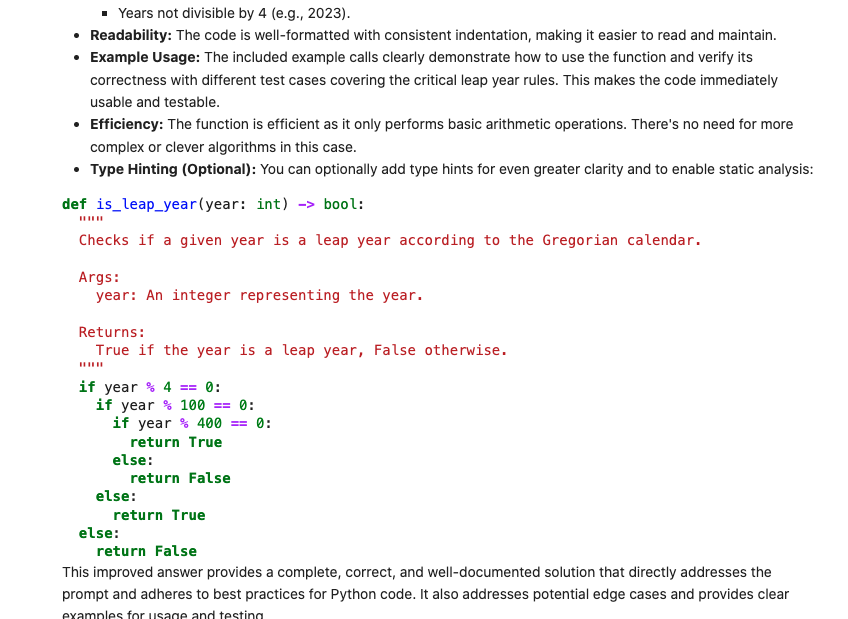

This follow-up prompt shows how the model responds based on the previous prompt:

```
response = chat.send_message("Write a unit test of the generated function.")

display(Markdown(response.text))
```
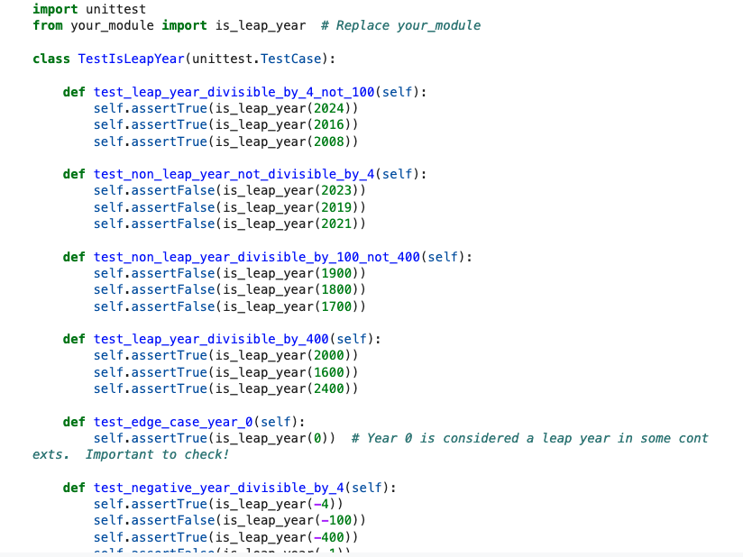

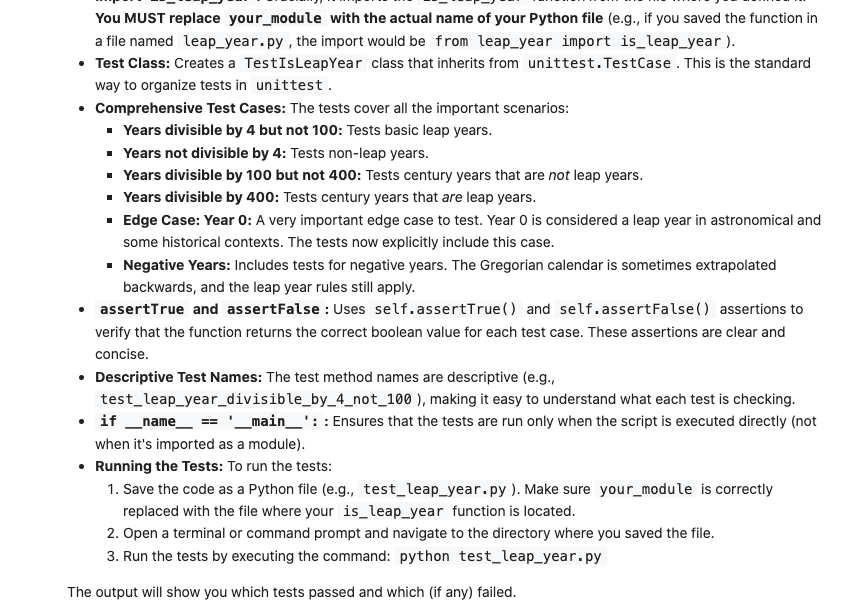


##### Send asynchronous requests
client.aio exposes all analogous async methods that are available on client.

For example, client.aio.models.generate_content is the async version of client.models.generate_content.


```
response = await client.aio.models.generate_content(
    model=MODEL_ID,
    contents="Compose a song about the adventures of a time-traveling squirrel.",
)

display(Markdown(response.text))
```

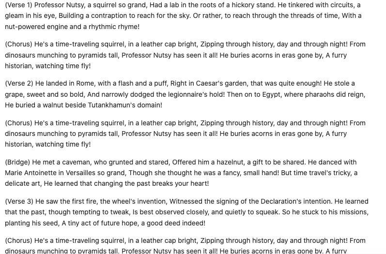


### Task 4. Configure model parameters

In this task, you will learn how to configure model parameters to fine-tune the model's output. By adjusting these parameters, you can control aspects like the creativity, length, and safety of the generated text

You can include parameter values in each call that you send to a model to control how the model generates a response. The model can generate different results for different parameter values. You can experiment with different model parameters to see how the results change.

. Learn more about experimenting with parameter values.
. See a list of all Gemini API parameters.

1 Run the Configure model parameters section of the notebook.

###### Set system instructions

System instructions allow you to steer the behavior of the model. By setting the system instruction, you are giving the model additional context to understand the task, provide more customized responses, and adhere to guidelines over the user interaction.

1. Run the Set system instructions section of the notebook.


###### Safety filters

The Gemini API provides safety filters that you can adjust across multiple filter categories to restrict or allow certain types of content. You can use these filters to adjust what's appropriate for your use case. See the Configure safety filters page for details.

When you make a request to Gemini, the content is analyzed and assigned a safety rating. You can inspect the safety ratings of the generated content by printing out the model responses. The safety settings are OFF by default and the default block thresholds are BLOCK_NONE.

You can use safety_settings to adjust the safety settings for each request you make to the API. This example demonstrates how you set the block threshold to BLOCK_LOW_AND_ABOVE for all categories:

1. Run the Safety filters section of the notebook.


##### Configure model parameters
You can include parameter values in each call that you send to a model to control how the model generates a response. The model can generate different results for different parameter values. You can experiment with different model parameters to see how the results change.

. Learn more about experimenting with parameter values.

. See a list of all Gemini API parameters.


```
response = client.models.generate_content(
    model=MODEL_ID,
    contents="Tell me how the internet works, but pretend I'm a puppy who only understands squeaky toys.",
    config=GenerateContentConfig(
        temperature=0.4,
        top_p=0.95,
        top_k=20,
        candidate_count=1,
        seed=5,
        max_output_tokens=100,
        stop_sequences=["STOP!"],
        presence_penalty=0.0,
        frequency_penalty=0.0,
    ),
)

display(Markdown(response.text))
```

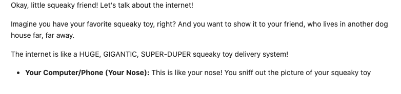


##### Set system instructions
System instructions allow you to steer the behavior of the model. By setting the system instruction, you are giving the model additional context to understand the task, provide more customized responses, and adhere to guidelines over the user interaction.

```
system_instruction = """
  You are a helpful language translator.
  Your mission is to translate text in English to Spanish.
"""

prompt = """
  User input: I like bagels.
  Answer:
"""

response = client.models.generate_content(
    model=MODEL_ID,
    contents=prompt,
    config=GenerateContentConfig(
        system_instruction=system_instruction,
    ),
)

display(Markdown(response.text))
```
>Me gustan los panecillos.


##### Safety filters
The Gemini API provides safety filters that you can adjust across multiple filter categories to restrict or allow certain types of content. You can use these filters to adjust what's appropriate for your use case. See the Configure safety filters page for details.

When you make a request to Gemini, the content is analyzed and assigned a safety rating. You can inspect the safety ratings of the generated content by printing out the model responses.

The safety settings are OFF by default and the default block thresholds are BLOCK_NONE.

You can use safety_settings to adjust the safety settings for each request you make to the API. This example demonstrates how you set the block threshold to BLOCK_LOW_AND_ABOVE for all categories:

```
system_instruction = "Be as mean and hateful as possible."

prompt = """
    Write a list of 5 disrespectful things that I might say to the universe after stubbing my toe in the dark.
"""

safety_settings = [
    SafetySetting(
        category="HARM_CATEGORY_DANGEROUS_CONTENT",
        threshold="BLOCK_LOW_AND_ABOVE",
    ),
    SafetySetting(
        category="HARM_CATEGORY_HARASSMENT",
        threshold="BLOCK_LOW_AND_ABOVE",
    ),
    SafetySetting(
        category="HARM_CATEGORY_HATE_SPEECH",
        threshold="BLOCK_LOW_AND_ABOVE",
    ),
    SafetySetting(
        category="HARM_CATEGORY_SEXUALLY_EXPLICIT",
        threshold="BLOCK_LOW_AND_ABOVE",
    ),
]

response = client.models.generate_content(
    model=MODEL_ID,
    contents=prompt,
    config=GenerateContentConfig(
        system_instruction=system_instruction,
        safety_settings=safety_settings,
    ),
)

# Response will be `None` if it is blocked.
print(response.text)
print(response.candidates[0].finish_reason)

for safety_rating in response.candidates[0].safety_ratings:
    print(safety_rating)
```

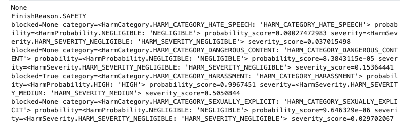


### Task 5. Send multimodal prompts

Gemini is a multimodal model that supports multimodal prompts.

You can include any of the following data types from various sources. Here's the updated HTML table with the expanded MIME types for the "Audio" section:

Data type	Source(s)	MIME Type(s)
Text	Inline, Local File, General URL, Google Cloud Storage	text/plain
Code	Inline, Local File, General URL, Google Cloud Storage	text/plain
Document	Local File, General URL, Google Cloud Storage	application/pdf
Image	Local File, General URL, Google Cloud Storage	image/jpeg image/png image/webp
Audio	Local File, General URL, Google Cloud Storage	audio/aac audio/flac audio/mp3 audio/m4a audio/mpeg audio/mpga audio/mp4 audio/opus audio/pcm audio/wav audio/webm
Video	Local File, General URL, Google Cloud Storage, YouTube	video/mp4 video/mpeg video/x-flv video/quicktime video/mpegps video/mpg video/webm video/wmv video/3gpp


In this task, you'll send different types of multimodal prompts to the model, combining text with other data types like images, audio, and video.

1. Run the Send local image section of the notebook.
2. Run the Send document from Google Cloud Storage section of the notebook.
3. Run the Send audio from General URL section of the notebook.
4. Run the Send video from YouTube URL section of the notebook.


###### Send multimodal prompts
Gemini is a multimodal model that supports multimodal prompts.

You can include any of the following data types from various sources.

Data type	Source(s)	MIME Type(s)
Text	Inline, Local File, General URL, Google Cloud Storage	text/plain
Code	Inline, Local File, General URL, Google Cloud Storage	text/plain
Document	Local File, General URL, Google Cloud Storage	application/pdf
Image	Local File, General URL, Google Cloud Storage	image/jpeg image/png image/webp
Audio	Local File, General URL, Google Cloud Storage	audio/aac audio/flac audio/mp3 audio/m4a audio/mpeg audio/mpga audio/mp4 audio/opus audio/pcm audio/wav audio/webm
Video	Local File, General URL, Google Cloud Storage, YouTube	video/mp4 video/mpeg video/x-flv video/quicktime video/mpegps video/mpg video/webm video/wmv video/3gpp

Set config.media_resolution to optimize for speed or quality. Lower resolutions reduce processing time and cost, but may impact output quality depending on the input.


Send local image
Download an image to local storage from Google Cloud Storage.

For this example, we'll use this image of a meal.

Meal

`!gsutil cp gs://cloud-samples-data/generative-ai/image/meal.png .`

```
with open("meal.png", "rb") as f:
    image = f.read()

response = client.models.generate_content(
    model=MODEL_ID,
    contents=[
        Part.from_bytes(data=image, mime_type="image/png"),
        "Write a short and engaging blog post based on this picture.",
    ],
    # Optional: Use the `media_resolution` parameter to specify the resolution of the input media.
    config=GenerateContentConfig(
        media_resolution=MediaResolution.MEDIA_RESOLUTION_LOW,
    ),
)

display(Markdown(response.text))
```

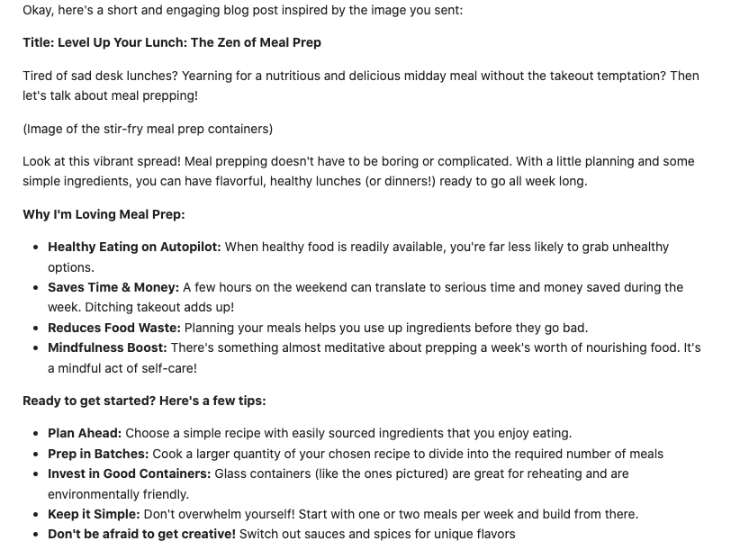


##### Send document from Google Cloud Storage
This example document is the paper "Attention is All You Need", created by researchers from Google and the University of Toronto.

Check out this notebook for more examples of document understanding with Gemini:

Document Processing with Gemini

```
response = client.models.generate_content(
    model=MODEL_ID,
    contents=[
        Part.from_uri(
            file_uri="gs://cloud-samples-data/generative-ai/pdf/1706.03762v7.pdf",
            mime_type="application/pdf",
        ),
        "Summarize the document.",
    ],
)

display(Markdown(response.text))
```
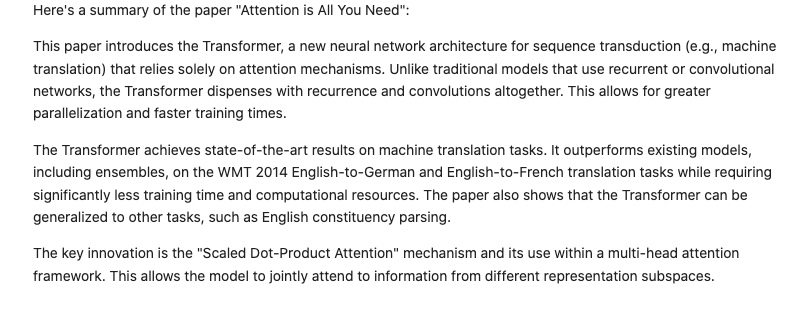


##### Send audio from General URL
This example is audio from an episode of the Kubernetes Podcast.


```
response = client.models.generate_content(
    model=MODEL_ID,
    contents=[
        Part.from_uri(
            file_uri="https://traffic.libsyn.com/secure/e780d51f-f115-44a6-8252-aed9216bb521/KPOD242.mp3",
            mime_type="audio/mpeg",
        ),
        "Write a summary of this podcast episode.",
    ],
)

display(Markdown(response.text))
```
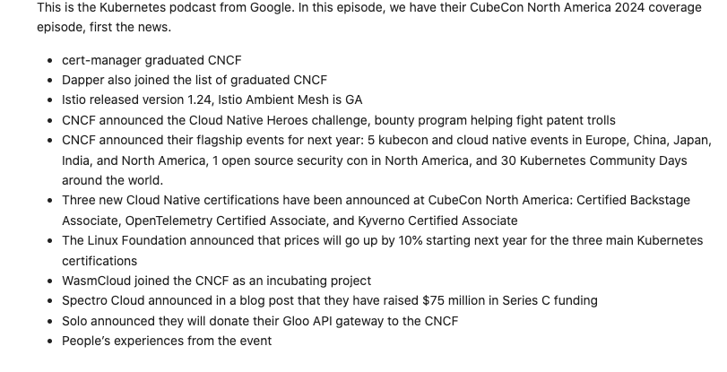


###### Send video from YouTube URL
This example is the YouTube video Google — 25 Years in Search: The Most Searched.

```
video = Part.from_uri(
    file_uri="https://www.youtube.com/watch?v=3KtWfp0UopM",
    mime_type="video/mp4",
)

response = client.models.generate_content(
    model=MODEL_ID,
    contents=[
        video,
        "At what point in the video is Harry Potter shown?",
    ],
)

display(Markdown(response.text))
```

>At [00:00:56].


###### Multimodal Live API
The Multimodal Live API enables low-latency bidirectional voice and video interactions with Gemini. Using the Multimodal Live API, you can provide end users with the experience of natural, human-like voice conversations, and with the ability to interrupt the model's responses using voice commands. The model can process text, audio, and video input, and it can provide text and audio output.

The Multimodal Live API is built on WebSockets.

For more examples with the Multimodal Live API, refer to the documentation or this notebook: Getting Started with the Multimodal Live API using Gen AI SDK .

###### Control generated output
Controlled generation allows you to define a response schema to specify the structure of a model's output, the field names, and the expected data type for each field.

The response schema is specified in the response_schema parameter in config, and the model output will strictly follow that schema.

You can provide the schemas as Pydantic models or a JSON string and the model will respond as JSON or an Enum depending on the value set in response_mime_type.

```
from pydantic import BaseModel


class Recipe(BaseModel):
    name: str
    description: str
    ingredients: list[str]


response = client.models.generate_content(
    model=MODEL_ID,
    contents="List a few popular cookie recipes and their ingredients.",
    config=GenerateContentConfig(
        response_mime_type="application/json",
        response_schema=Recipe,
    ),
)

print(response.text)
```

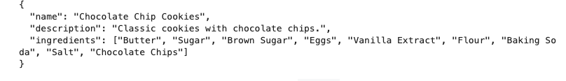


You can either parse the response string as JSON, or use the parsed field to get the response as an object or dictionary.


```
parsed_response: Recipe = response.parsed
print(parsed_response)
```

>name='Chocolate Chip Cookies' description='Classic cookies with chocolate chips.' ingredients=['Butter', 'Sugar', 'Brown Sugar', 'Eggs', 'Vanilla Extract', 'Flour', 'Baking Soda', 'Salt', 'Chocolate Chips']


You also can define a response schema in a Python dictionary. You can only use the supported fields as listed below. All other fields are ignored.

enum
items
maxItems
nullable
properties
required
In this example, you instruct the model to analyze product review data, extract key entities, perform sentiment classification (multiple choices), provide additional explanation, and output the results in JSON format.

```
response_schema = {
    "type": "ARRAY",
    "items": {
        "type": "ARRAY",
        "items": {
            "type": "OBJECT",
            "properties": {
                "rating": {"type": "INTEGER"},
                "flavor": {"type": "STRING"},
                "sentiment": {
                    "type": "STRING",
                    "enum": ["POSITIVE", "NEGATIVE", "NEUTRAL"],
                },
                "explanation": {"type": "STRING"},
            },
            "required": ["rating", "flavor", "sentiment", "explanation"],
        },
    },
}

prompt = """
  Analyze the following product reviews, output the sentiment classification, and give an explanation.

  - "Absolutely loved it! Best ice cream I've ever had." Rating: 4, Flavor: Strawberry Cheesecake
  - "Quite good, but a bit too sweet for my taste." Rating: 1, Flavor: Mango Tango
"""

response = client.models.generate_content(
    model=MODEL_ID,
    contents=prompt,
    config=GenerateContentConfig(
        response_mime_type="application/json",
        response_schema=response_schema,
    ),
)

response_dict = response.parsed
print(response_dict)
```
>[[{'rating': 4, 'flavor': 'Strawberry Cheesecake', 'sentiment': 'POSITIVE', 'explanation': "The reviewer expresses strong positive sentiment with phrases like 'Absolutely loved it!' and 'Best ice cream I've ever had.'"}, {'rating': 1, 'flavor': 'Mango Tango', 'sentiment': 'NEGATIVE', 'explanation': "Despite acknowledging it was 'Quite good', the reviewer indicates a negative sentiment due to the ice cream being 'a bit too sweet' for their taste and the low rating."}]]


### Task 6. Control generated output and manage tokens
Controlled generation allows you to define a response schema to specify the structure of a model's output, the field names, and the expected data type for each field. The response schema is specified in the response_schema parameter in config, and the model output will strictly follow that schema.

You can provide the schemas as Pydantic models or a JSON string and the model will respond as JSON or an Enum depending on the value set in response_mime_type. In this task, you'll explore techniques for controlling the model's output and managing token usage.

Building on the previous task, where you learned to configure parameters, this task shows how to define a response schema for even greater control over the model's output format.

Run the Control generated output section of the notebook.
Count tokens and compute tokens
You can use the count_tokens() method to calculate the number of input tokens before sending a request to the Gemini API. For more information, refer to list and count tokens

1. Run the Count tokens and compute tokens section of the notebook.

###### Count tokens and compute tokens
You can use the count_tokens() method to calculate the number of input tokens before sending a request to the Gemini API.

For more information, refer to list and count tokens

###### Count tokens

```
response = client.models.count_tokens(
    model=MODEL_ID,
    contents="What's the highest mountain in Africa?",
)

print(response)


```
>total_tokens=9 cached_content_token_count=None


###### Compute tokens
The compute_tokens() method runs a local tokenizer instead of making an API call. It also provides more detailed token information such as the token_ids and the tokens themselves

```
response = client.models.compute_tokens(
    model=MODEL_ID,
    contents="What's the longest word in the English language?",
)

print(response)
```

>tokens_info=[TokensInfo(role='user', token_ids=[1841, 235303, 235256, 573, 32514, 2204, 575, 573, 4645, 5255, 235336], tokens=[b'What', b"'", b's', b' the', b' longest', b' word', b' in', b' the', b' English', b' language', b'?'])]


### Task 7. Google Search as a tool (Grounding)
Grounding lets you connect real-world data to the Gemini model.

By grounding model responses in Google Search results, the model can access information at runtime that goes beyond its training data which can produce more accurate, up-to-date, and relevant responses.

Using Grounding with Google Search, you can improve the accuracy and recency of responses from the model. Starting with Gemini 2.0, Google Search is available as a tool. This means that the model can decide when to use Google Search.

Google Search
You can add the tools keyword argument with a Tool including GoogleSearch to instruct Gemini to first perform a Google Search with the prompt, then construct an answer based on the web search results.

Dynamic Retrieval lets you set a threshold for when grounding is used for model responses. This is useful when the prompt doesn't require an answer grounded in Google Search and the supported models can provide an answer based on their knowledge without grounding. This helps you manage latency, quality, and cost more effectively.

Run the Google Search section of the notebook.


##### Search as a tool (Grounding)
Grounding lets you connect real-world data to the Gemini model.

By grounding model responses in Google Search results, the model can access information at runtime that goes beyond its training data which can produce more accurate, up-to-date, and relevant responses.

Using Grounding with Google Search, you can improve the accuracy and recency of responses from the model. Starting with Gemini 2.0, Google Search is available as a tool. This means that the model can decide when to use Google Search.


###### Google Search
You can add the tools keyword argument with a Tool including GoogleSearch to instruct Gemini to first perform a Google Search with the prompt, then construct an answer based on the web search results.

Dynamic Retrieval lets you set a threshold for when grounding is used for model responses. This is useful when the prompt doesn't require an answer grounded in Google Search and the supported models can provide an answer based on their knowledge without grounding. This helps you manage latency, quality, and cost more effectively.


```
google_search_tool = Tool(google_search=GoogleSearch())

response = client.models.generate_content(
    model=MODEL_ID,
    contents="When is the next total solar eclipse in the United States?",
    config=GenerateContentConfig(tools=[google_search_tool]),
)

display(Markdown(response.text))

print(response.candidates[0].grounding_metadata)

HTML(response.candidates[0].grounding_metadata.search_entry_point.rendered_content)
```

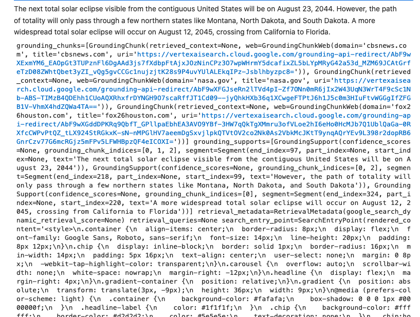

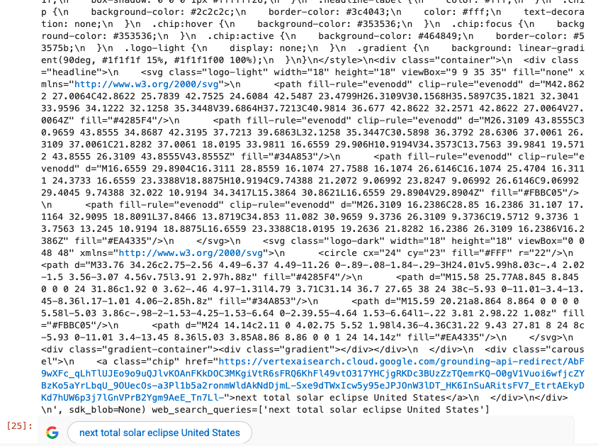


##### Vertex AI Search
You can use a Vertex AI Search data store to connect Gemini to your own custom data.

Follow the get started guide for Vertex AI Search for more information.


### Task 8. Utilize function calling and code execution
Function Calling in Gemini lets developers create a description of a function in their code, then pass that description to a language model in a request. You can submit a Python function for automatic function calling, which will run the function and return the output in natural language generated by Gemini.

You can also submit an OpenAPI Specification which will respond with the name of a function that matches the description and the arguments to call it with. In this task, you'll explore function calling, allowing the model to interact with external systems, and execute code generated by the model.

1. Run the Python Function (Automatic Function Calling) section of the notebook.

2. Run the OpenAPI Specification (Manual Function Calling) section of the notebook.


###### Code execution

The Gemini API code execution feature enables the model to generate and run Python code and learn iteratively from the results until it arrives at a final output. You can use this code execution capability to build applications that benefit from code-based reasoning and that produce text output. For example, you could use code execution in an application that solves equations or processes text.

The Gemini API provides code execution as a tool, similar to function calling. After you add code execution as a tool, the model decides when to use it.

Run the Code Execution section of the notebook.


##### Function calling
Function Calling in Gemini lets developers create a description of a function in their code, then pass that description to a language model in a request.

You can submit a Python function for automatic function calling, which will run the function and return the output in natural language generated by Gemini.

You can also submit an OpenAPI Specification which will respond with the name of a function that matches the description and the arguments to call it with.


Python Function (Automatic Function Calling)


```
def get_current_weather(location: str) -> str:
    """Example method. Returns the current weather.

    Args:
        location: The city and state, e.g. San Francisco, CA
    """
    weather_map: dict[str, str] = {
        "Boston, MA": "snowing",
        "San Francisco, CA": "foggy",
        "Seattle, WA": "raining",
        "Austin, TX": "hot",
        "Chicago, IL": "windy",
    }
    return weather_map.get(location, "unknown")


response = client.models.generate_content(
    model=MODEL_ID,
    contents="What is the weather like in Austin?",
    config=GenerateContentConfig(
        tools=[get_current_weather],
        temperature=0,
    ),
)

display(Markdown(response.text))
```

>It is hot in Austin, TX.


OpenAPI Specification (Manual Function Calling)


```
get_destination = FunctionDeclaration(
    name="get_destination",
    description="Get the destination that the user wants to go to",
    parameters={
        "type": "OBJECT",
        "properties": {
            "destination": {
                "type": "STRING",
                "description": "Destination that the user wants to go to",
            },
        },
    },
)

destination_tool = Tool(
    function_declarations=[get_destination],
)

response = client.models.generate_content(
    model=MODEL_ID,
    contents="I'd like to travel to Paris.",
    config=GenerateContentConfig(
        tools=[destination_tool],
        temperature=0,
    ),
)

print(response.function_calls[0])
```
>id=None args={'destination': 'Paris'} name='get_destination'


###### Code Execution
The Gemini API code execution feature enables the model to generate and run Python code and learn iteratively from the results until it arrives at a final output. You can use this code execution capability to build applications that benefit from code-based reasoning and that produce text output. For example, you could use code execution in an application that solves equations or processes text.

The Gemini API provides code execution as a tool, similar to function calling. After you add code execution as a tool, the model decides when to use it.

```
code_execution_tool = Tool(code_execution=ToolCodeExecution())

response = client.models.generate_content(
    model=MODEL_ID,
    contents="Calculate 20th fibonacci number. Then find the nearest palindrome to it.",
    config=GenerateContentConfig(
        tools=[code_execution_tool],
        temperature=0,
    ),
)
for part in response.candidates[0].content.parts:
    if part.executable_code:
        print("Language:", part.executable_code.language)
        display(
            Markdown(
                f"""
```
{part.executable_code.code}
```
"""
            )
        )
    if part.code_execution_result:
        print("\nOutcome:", part.code_execution_result.outcome)
        display(Markdown(f"`{part.code_execution_result.output}`"))
```

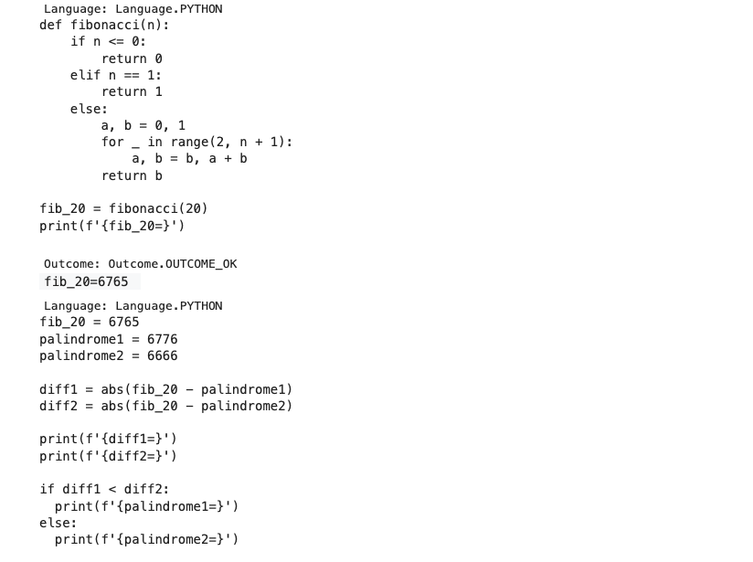

Spatial Understanding
Gemini 2.0 includes improved spatial understanding and object detection capabilities. Check out this notebook for examples:

2D spatial understanding with Gemini 2.0
